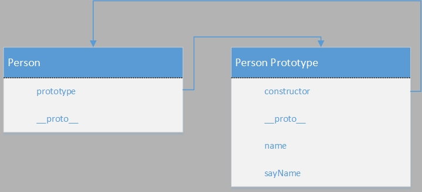
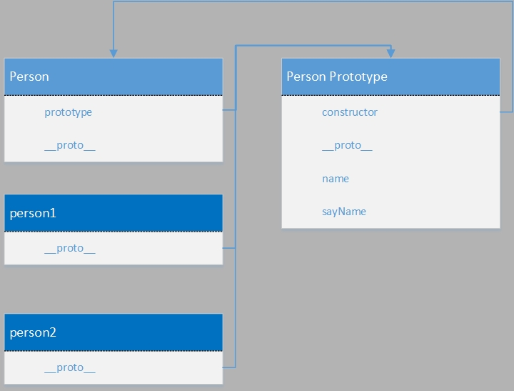
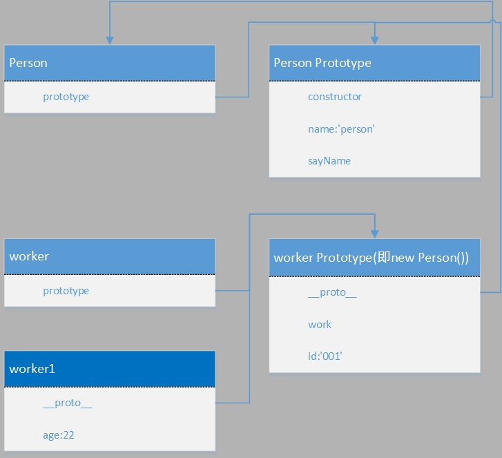
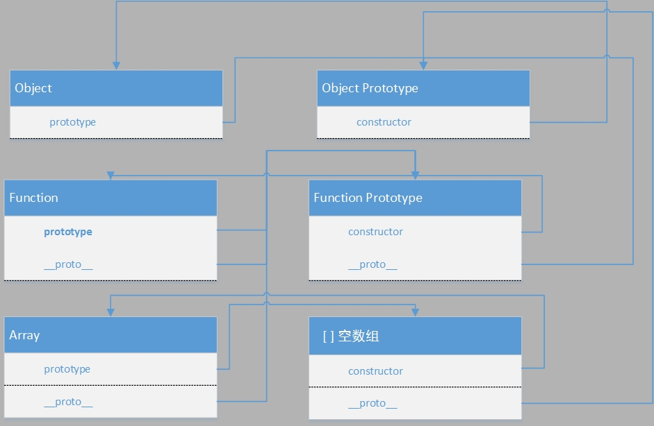
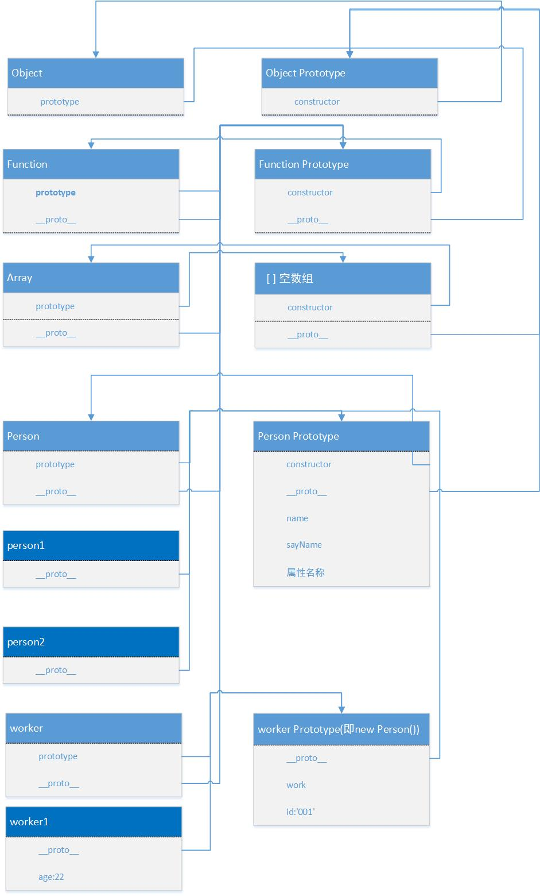

# Js中的prototype和__proto__

## <div style="background-color:#2d2d2d;color:white">原型对象prototype</div>
无论什么时候，当创建了一个函数，那么该函数将会自动创建一个prototype属性，这个属性指向函数的原型对象。而原型对象都会自动获得一个construct属性，该属性指向prototype属性所在函数；
例如对于下面的js代码：
```javascript
function Person (){
    this.id='001'
};
Person.prototype.name='person';
Person.prototype.sayName = function(){
    console.log(this.name);
}
```
  那么，我们可以通过试验知道如下：
Person具有一个prototype属性，他指向一个原型对象，我们叫他Person Prototype，那么代码中我们给这个原型对象加上了name属性和一个sayName方法；所以他们之间的关系如下：


## <div style="background-color:#2d2d2d;color:white">【【prototype】】 或者__proto__</div>

当调用构造函数创建一个新实例时，该实例内部包含一个指针，我们记为【【prototype】】，该属性原本是不可见的，但是Firefox、Safari和chrome等浏览器将这个属性暴露出来，我们可以通过__proto__来访问这个属性，那么这个属性是什么呢？这个属性也是一个引用，**这个引用指向该实例的构造函数的原型对象**
我们使用以下代码来实例化Person；
```javascript
>var person1 = new Person();
var person2 = new Person();
```
这里我们构建了2个Person实例，他们之间的关系如下：


## <div style="background-color:#2d2d2d;color:white">原型继承</div>
说到原型，就不得不说继承，废话不多说，直接上代码解析；
```javascript
    var worker = function(){
        this.age=22;
    };
    worker.prototype = new Person();
    worker.prototype.work=function(){
        console.log("working")
    }
```

这里的意愿是让worker继承自Person，因此将worker的prototype属性设置为一个Person实例，根据上面的分析可以得到以下联系：


## <div style="background-color:#2d2d2d;color:white">Object、Function和Array之间的联系</div>
这里我们只是追溯到了Person的原型对象，如果再跟着原型链往下跟进呢，我们可以试试看：
```javascript
Person.__proto__ === Function.prototype
true
```

也就是说Person本质是一个函数，因此其构造函数为Funtion，所以Person.__proto__指向Function的原型对象；

再往深处追溯，我们就跟踪到Object、Function和Array这几个数据类型，我们知道Function、Array都是对象，那么他们之间是怎么联系的呢？
要搞清楚者三者之间的联系，需要做一下简单的试验：
```javascript
Function.prototype.__proto__ === Object.prototype
true
Function.prototype===Function.__proto__
true
Array.prototype
[]
Array.__proto__===Function.prototype
true
Array.prototype.__proto__===Object.prototype
true
```




##  <div style="background-color:#2d2d2d;color:white">汇总</div>
将以上代码汇总到一起，并绘制他们之间的关系图如下：
